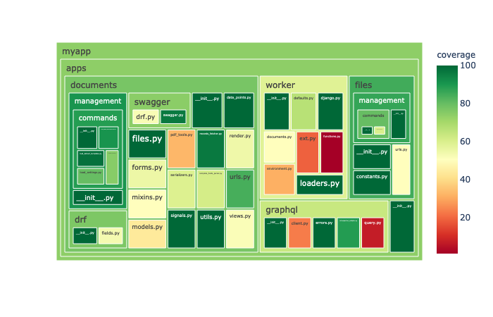
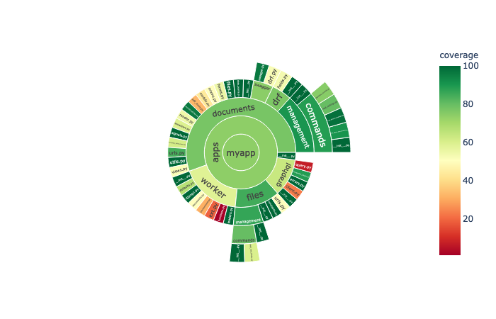

=============
plot_coverage
=============

.. image:: https://img.shields.io/pypi/v/plot_coverage.svg
        :target: https://pypi.python.org/pypi/plot_coverage

.. image:: https://img.shields.io/travis/modasserbillah/plot_coverage.svg
        :target: https://travis-ci.com/modasserbillah/plot_coverage

Python package to generate plots from coverage report

Generate visual plots to demonstrate your code coverage. Interactive plots are opened in the browser immediately
after running the script. HTML files for the plots are stored alongside the coverage report inside `htmlcov` folder.

Plots are generated using plotly express.

Usage
------
* Install using `pip install plot_coverage`
* From the project root (where htmlcov folder is located), run:
        - `plot_coverage --plot=treemap`
        - `plot_coverage --plot=sunburst`

Example
-------

Treemap
========

Sunburst
=========

Features
--------

* Generate Treemap plot for showing your coverage report with color sequence based on coverage percentage.
* Generate Sunburst plot for showing your coverage report with color sequence based on coverage percentage.

Credits
-------

This package was created with Cookiecutter_ and the `audreyr/cookiecutter-pypackage`_ project template.

.. _Cookiecutter: https://github.com/audreyr/cookiecutter
.. _`audreyr/cookiecutter-pypackage`: https://github.com/audreyr/cookiecutter-pypackage

* Free software: BSD license